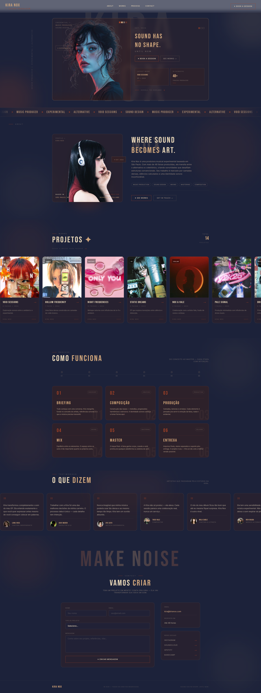

# KIRA NOX — Sound Producer Portfolio

<div align="center">


**Portfólio fictício de produtora musical experimental 🎵**

Site com design experimental e vintage, carrosséis animados, glassmorphism e interatividade

</div>

---

## Sobre o Projeto

**KIRA NOX** é um portfólio fictício de uma produtora musical experimental baseada em São Paulo. O projeto foi desenvolvido com foco em design diferenciado, com paleta vintage, tipografia impactante, elementos glassmorphism e animações fluidas — inspirado em layouts editoriais modernos.

### Características Principais

- Hero com glassmorphism e imagem em destaque
- Carrosséis animados com pausa no hover
- Loading screen animada
- Seção de projetos com capas de álbuns reais
- Timeline animada com Intersection Observer
- Depoimentos com fotos e carrossel contínuo
- Formulário de contato estilizado
- Favicon personalizado em SVG
- Design totalmente baseado em paleta vintage customizada

---

## Preview

<div align="center">



*Design experimental com paleta vintage e elementos glassmorphism*

</div>

---

## Tecnologias Utilizadas

| Tecnologia | Versão | Uso |
|---|---|---|
|  | 18.3.1 | Biblioteca de UI |
|  | 5.x | Build tool |
|  | 3.4 | Estilização |
|  | ES2022 | Lógica e interatividade |
|  | — | Fontes (Bebas Neue + Inter) |
|  | — | Transformações CSS |

---

## Como Rodar o Projeto

### Pré-requisitos

- Node.js (versão 18 ou superior)
- npm

### Instalação

1. **Clone o repositório**

```bash
git clone https://github.com/erikalaiane/kira-nox.git
```

2. **Entre no diretório do projeto**

```bash
cd kira-nox
```

3. **Instale as dependências**

```bash
npm install
```

4. **Inicie o servidor de desenvolvimento**

```bash
npm run dev
```

5. **Abra no navegador**

Acesse [http://localhost:5173](http://localhost:5173)

---

## Scripts Disponíveis

```bash
npm run dev      # Inicia servidor de desenvolvimento
npm run build    # Cria build de produção
npm run preview  # Preview da build de produção
npm run lint     # Executa o linter
```

---

## Estrutura do Projeto

```
kira-nox/
├── public/
│   ├── favicon.svg          # Favicon personalizado
│   └── kira-nox.png         # Preview do site
├── src/
│   ├── assets/              # Imagens (kira.png, covers, persons)
│   ├── components/
│   │   ├── Navbar.jsx       # Menu com blur e animações
│   │   ├── Hero.jsx         # Hero com glassmorphism
│   │   ├── Marquee.jsx      # Faixa animada contínua
│   │   ├── About.jsx        # Seção sobre com card e blob
│   │   ├── Works.jsx        # Carrossel de projetos animado
│   │   ├── Process.jsx      # Timeline com Intersection Observer
│   │   ├── Testimonials.jsx # Carrossel de depoimentos
│   │   ├── Contact.jsx      # Formulário + footer
│   │   └── LoadingScreen.jsx# Tela de carregamento animada
│   ├── App.jsx              # Componente principal
│   ├── main.jsx             # Ponto de entrada
│   └── index.css            # Estilos globais e keyframes
├── index.html
├── package.json
├── tailwind.config.js       # Cores e animações customizadas
├── postcss.config.js
└── README.md
```

---

## Funcionalidades

### 🎬 Loading Screen
- Animação de entrada com nome e tagline
- Barra de progresso animada
- Fade out suave antes de revelar o site

### 🎯 Navbar
- Fundo com blur e borda sutil
- Subtítulo "sound producer" em terracota
- Links com underline animado no hover
- Botão com efeito de preenchimento

### 🖼️ Hero Section
- Caixa glassmorphism central dividida em duas colunas
- Tipografia gigante em Bebas Neue atrás da imagem
- Cards com tagline, último projeto e estatísticas
- Blobs de luz decorativos

### 📀 Works
- Carrossel automático com pausa no hover
- Capas de álbuns reais com zoom no hover
- Cards com scale e mudança de cor no hover
- 14 projetos entre EPs, Singles, Collabs e Mixtapes

### ⚡ Process
- Grid de 6 etapas do processo de produção
- Animação com Intersection Observer — cada card acende ao entrar na tela
- Número decorativo gigante em cada card

### 💬 Testimonials
- Carrossel contínuo com 8 depoimentos
- Foto, nome e cargo de cada artista
- Pausa no hover

### 📬 Contact
- Tipografia "MAKE NOISE" com gradiente
- Formulário completo com seleção de tipo de projeto
- Cards laterais com email, tempo de resposta e redes sociais
- Footer com tagline

---

## Design System

### Paleta de Cores

```css
--kira-bg:    #1C223A  /* Azul profundo — fundo principal */
--kira-gold:  #CDA47B  /* Caramelo dourado — tipografia e destaques */
--kira-terra: #9F4125  /* Terracota queimado — acentos e botões */
--kira-cream: #E5D4B6  /* Creme — textos secundários */
--kira-dark:  #382020  /* Marrom escuro — sombras e profundidade */
```

### Tipografia

- **Display**: Bebas Neue — títulos, números e elementos de destaque
- **Corpo**: Inter — textos corridos e descrições

---

## Padrões de Commit

Seguimos o padrão de commits semânticos:

- `feat:` — Nova funcionalidade
- `fix:` — Correção de bug
- `style:` — Mudanças de estilo
- `refactor:` — Refatoração de código
- `docs:` — Alterações na documentação
- `chore:` — Tarefas de manutenção

---

## Autora

**Erika Laiane**

Estudante de Análise e Desenvolvimento de Sistemas  
Apaixonada por tecnologia, design e front-end criativo 🎨

[](https://github.com/erikalaiane)
[](https://www.linkedin.com/in/erika-laiane-azevedo)
[](mailto:erikalaianeazevedosantos@gmail.com)

---

<div align="center">

Desenvolvido com 💜 e muita criatividade por Erika Laiane

**#FrontEnd** | **#ReactJS** | **#TailwindCSS** | **#Design**

[⬆ Voltar ao topo](#kira-nox--sound-producer-portfolio)

</div>